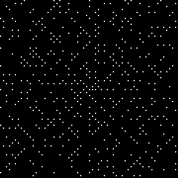

# Prime-Spiral

The prime spiral is a graphical depiction of the set of prime numbers. <a href="https://en.wikipedia.org/wiki/Ulam_spiral">read more about it on wikipedia</a>. You can change the size in the source to meet your requirement.



## Requirements
- Python3
- PyGame

## Use

```bash
$ python3 main.py
```